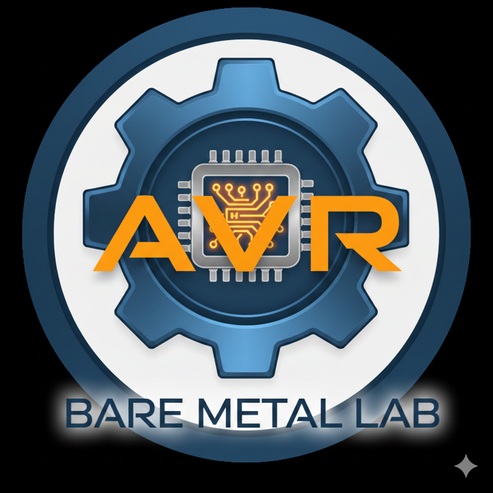

  
  

  # AVR-BareMetal-Lab
  
  *"Un viaje autodidacta hacia las profundidades del ATmega328P: Redescubriendo el hardware mediante arquitectura de capas y herramientas open-source."*

---

## 🚀 Descripción
Exploración profunda del **ATmega328P** mediante firmware **Bare Metal** y arquitectura de capas. Este repositorio despliega una **HAL personalizada** desde cero, utilizando un toolchain profesional (**avr-gcc + Makefiles**). Ideal para ingenieros que buscan dominar el control total del hardware sin dependencias, desde bits hasta drivers modulares.

## 🛠️ Toolchain & Entorno
Para mantener la portabilidad, este proyecto utiliza un conjunto de herramientas externas. Puedes obtener el entorno completo de compilación en el siguiente repositorio auxiliar:

👉 **[AVR-Toolchain-Portable](https://github.com/TuUsuario/AVR-Toolchain-Portable)**

> **Nota:** Para que los Makefiles funcionen por defecto, el contenido del repositorio de herramientas debe clonarse o copiarse en una carpeta llamada `tools/` en la raíz de este directorio.

- **Compilador:** avr-gcc 15.2.0 (Portable)
- **Carga de Firmware:** avrdude
- **Automatización:** GNU Make
- **Hardware:** USBASP + ATmega328P

## 📂 Estructura de Capas
La arquitectura se divide en capas de abstracción para garantizar portabilidad y orden:

* **Capa 0 (Common):** Macros fundamentales de manipulación de bits atómicas (`bits.h`). El cimiento matemático del proyecto.
* **Capa 1 (Hardware/Drivers):** Abstracción de registros de periféricos mediante estructuras y punteros volátiles (`gpio.h/c`).
* **Capa 3 (Aplicación):** Lógica de alto nivel que consume los servicios de las capas inferiores, totalmente agnóstica de las direcciones de memoria.

## 🧪 Laboratorios
0. **[00_Fuses_Config](./projects/projects_m328p/00_Fuses_Config):** Configuración de Bits de Fusibles (Fuses) y Clock.
1. **[01_Blink_BareMetal](./projects/projects_m328p/01_Blink_BareMetal):** Control de registros mediante bit-shifting manual.
2. **[02_Blink_Bits](./projects/projects_m328p/02_Blink_Bits):** Uso de la Capa 0 para manipulación de bits.
3. **[03_Blink_GPIO_Driver](./projects/projects_m328p/03_Blink_GPIO_Driver):** Implementación de driver GPIO con estructuras y punteros.
4. **[04_GPIO_Polling_&_Debouncing](./projects/projects_m328p/04_GPIO_Polling):** Sistemas interactivos: Lectura de entradas, detección de flancos y filtrado de ruido mecánico.

---

## 🏁 Conclusión
Este repositorio no es solo una colección de ejemplos, sino un manifiesto de aprendizaje. Como autodidacta, entiendo que la verdadera maestría no reside en usar librerías preconfiguradas, sino en la capacidad de construir las propias. Poseer el control sobre el **Toolchain** y la **Arquitectura** es el paso necesario para transformar una placa de prototipado en un instrumento de ingeniería propia.