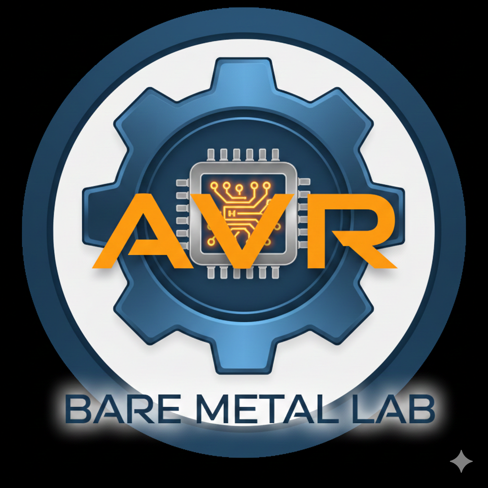
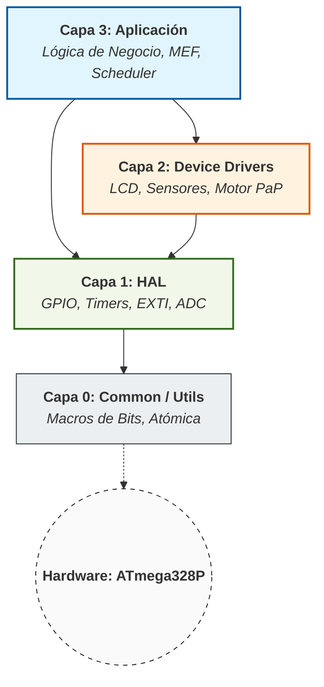

  
  

  # AVR-BareMetal-Lab
  
  *"Un viaje autodidacta hacia las profundidades del ATmega328P: Redescubriendo el hardware mediante arquitectura de capas y herramientas open-source."*

---

## 🚀 Descripción
Exploración profunda del **ATmega328P** mediante firmware **Bare Metal** y arquitectura de capas. Este repositorio despliega una **HAL personalizada** desde cero, utilizando un toolchain profesional (**avr-gcc + Makefiles**). Ideal para ingenieros que buscan dominar el control total del hardware sin dependencias, desde bits hasta drivers modulares.

## 🛠️ Toolchain & Entorno
Para mantener la portabilidad, este proyecto utiliza un conjunto de herramientas externas. Puedes obtener el entorno completo de compilación en el siguiente repositorio auxiliar:

👉 **[AVR-Toolchain-Portable](https://github.com/TuUsuario/AVR-Toolchain-Portable)**

> **Nota:** Para que los Makefiles funcionen por defecto, el contenido del repositorio de herramientas debe clonarse o copiarse en una carpeta llamada `tools/` en la raíz de este directorio.

- **Compilador:** avr-gcc 15.2.0 (Portable)
- **Carga de Firmware:** avrdude
- **Automatización:** GNU Make
- **Hardware:** USBASP + ATmega328P

---

## 🏗️ Arquitectura de Software (Modelo de 3 Capas)

La arquitectura del proyecto sigue un modelo de diseño jerárquico y desacoplado. Esta separación de responsabilidades garantiza que el firmware sea **portable, testeable y escalable**, permitiendo migrar de hardware con un impacto mínimo en la lógica de aplicación.

```mermaid
graph TD
    %% Definición de Nodos
    C3[<b>Capa 3: Aplicación</b><br/><i>Lógica de Negocio, MEF, Scheduler</i>]
    C2[<b>Capa 2: Device Drivers</b><br/><i>LCD, Sensores, Motor PaP</i>]
    C1[<b>Capa 1: HAL</b><br/><i>GPIO, Timers, EXTI, ADC</i>]
    C0[<b>Capa 0: Common / Utils</b><br/><i>Macros de Bits, Atómica</i>]
    HW((<b>Hardware: ATmega328P</b>))

    %% Relaciones de dependencia
    C3 --> C2
    C3 --> C1
    C2 --> C1
    C1 --> C0
    C0 -.-> HW

    %% Estilos
    style C3 fill:#e1f5fe,stroke:#01579b,stroke-width:2px
    style C2 fill:#fff3e0,stroke:#e65100,stroke-width:2px
    style C1 fill:#f1f8e9,stroke:#33691e,stroke-width:2px
    style C0 fill:#eceff1,stroke:#263238,stroke-width:1px
    style HW fill:#fafafa,stroke:#212121,stroke-dasharray: 5 5
```

## 📂 Descripción de Capas
La arquitectura del proyecto sigue un modelo de diseño jerárquico. Esto permite que el código sea escalable, fácil de testear y, sobre todo, portable entre diferentes microcontroladores de la familia AVR.

* **Capa 0 (Common - Utils):** Contiene las macros fundamentales de manipulación atómica de bits (`bits.h`). Es el cimiento matemático y lógico sobre el cual se construye todo el firmware.
* **Capa 1 (HAL - Hardware Abstraction Layer):** Abstracción directa de los periféricos internos del MCU (GPIO, Timers, ADC, UART). Utiliza estructuras y punteros volátiles para mapear registros, ocultando la complejidad del hardware a las capas superiores.
* **Capa 2 (Device Drivers):** Drivers para componentes externos al silicio (LCD 16x2, Sensores I2C/SPI, Drivers de Motores). Esta capa consume servicios de la HAL (Capa 1) y provee funciones de alto nivel para dispositivos específicos.
* **Capa 3 (Aplicación):** Lógica de control principal, Máquinas de Estado Finitos (MEF) y planificación de tareas. Es totalmente agnóstica de las direcciones de memoria y se comunica exclusivamente mediante las APIs de las capas inferiores.

---

## 📦 Librerías y Drivers (Ecosistema de Software)

El corazón de este proyecto reside en su modularidad. Las librerías están organizadas para facilitar la reutilización en proyectos futuros y se encuentran totalmente documentadas:

| Nivel | Componente | Descripción | Documentación |
| :--- | :--- | :--- | :---: |
| **Capa 0** | **Common** | Macros de bits y definiciones lógicas fundamentales. | [📄 Ver](./libs/common/) |
| **Capa 1** | **HAL M328P** | Abstracción de registros (GPIO, Timers, EXTI). | [📄 Ver](./libs/hal_m328p/) |
| **Capa 2** | **Devices** | Controladores externos (LCD 16x2, Motor PaP). | [📄 Ver](./libs/devices/) |

---

## 🎯 Objetivos del Proyecto
Este repositorio tiene como finalidad demostrar el dominio integral del ecosistema de 8 bits mediante las siguientes metas técnicas:
* **Soberanía Tecnológica:** Prescindir de librerías de alto nivel (Arduino/HALs comerciales) para comprender el flujo de datos desde el registro hasta la aplicación.
* **Modularidad y Reutilización:** Construir una biblioteca de drivers (HAL) propia, escalable y documentada bajo estándares industriales.
* **Gestión de Recursos:** Optimizar el uso de memoria (Flash/RAM) y ciclos de CPU mediante el uso estratégico de interrupciones y periféricos internos.
* **Documentación Técnica:** Mantener un estándar de documentación (Doxygen/Markdown) que permita la trazabilidad de cada decisión de diseño.

---

## 🛡️ Pilares de Robustez
Para garantizar la fiabilidad del firmware en entornos de tiempo real, cada módulo desarrollado en este laboratorio se rige por tres principios de grado industrial:

* **🧬 Atomicidad y Secciones Críticas:** Gestión rigurosa del registro de estado `SREG` y el uso de `cli()`/`sei()` para proteger el acceso a variables compartidas (como los contadores de 32 bits en arquitecturas de 8 bits), evitando condiciones de carrera.
* **💎 Encapsulamiento y Calificadores:** Uso mandatorio de `static` para limitar el alcance de variables a nivel de módulo y `volatile` para asegurar que el compilador respete los cambios de estado generados por el hardware o las ISR.
* **⚡ Eficiencia y Concurrencia:** Implementación de **Multitarea Cooperativa** y planificación basada en eventos (Timers/EXTI). Se prioriza liberar el CPU de esperas activas (`busy-waiting`) para permitir un procesamiento concurrente y de bajo consumo.

---

## 🧪 Ruta de Aprendizaje (Laboratorios)
La evolución técnica se divide en cuatro etapas clave que transforman el microcontrolador en un sistema embebido robusto:

* **Fundamentos de Silicio (00 - 02):** Configuración de Fuses, Clock y manipulación atómica de bits.
* **Abstracción de Hardware (03 - 04):** Desarrollo de la HAL GPIO, gestión de flancos y filtrado de ruido mecánico.
* **Gestión de Tiempo y Multitarea (05 - 06):** Implementación de Systick, Multitarea Cooperativa y Device Drivers (LCD).
* **Sistemas Orientados a Eventos (07 - 08):** Programación reactiva con EXTI y orquestación de Timers para control de potencia.

👉 **[Explorar el detalle técnico de cada laboratorio aquí](./projects/)**
👉 **[Consultar el manual de la HAL y Drivers aquí](./libs/)**

---

## 🏁 Conclusión
Este repositorio no es solo una colección de ejemplos, sino un manifiesto de aprendizaje. Como autodidacta, entiendo que la verdadera maestría no reside en usar librerías preconfiguradas, sino en la capacidad de construir las propias. Poseer el control sobre el **Toolchain** y la **Arquitectura** es el paso necesario para transformar una placa de prototipado en un instrumento de ingeniería propia.

---

## 👨‍💻 Autor

**Carlos** - Estudiante de Ingeniería Electrónica en la **UTN FRT**
* 🛠️ *Apasionado por los Sistemas Embebidos, la Robótica y el desarrollo Low-Level (ASM/C).*
* 🎯 *Miembro activo de la comunidad de robótica, enfocado en la creación de firmware robusto y eficiente.*

  
  

---

  <i>"El hardware es lo que hace que una máquina sea posible; el software es lo que hace que sea real."</i>

