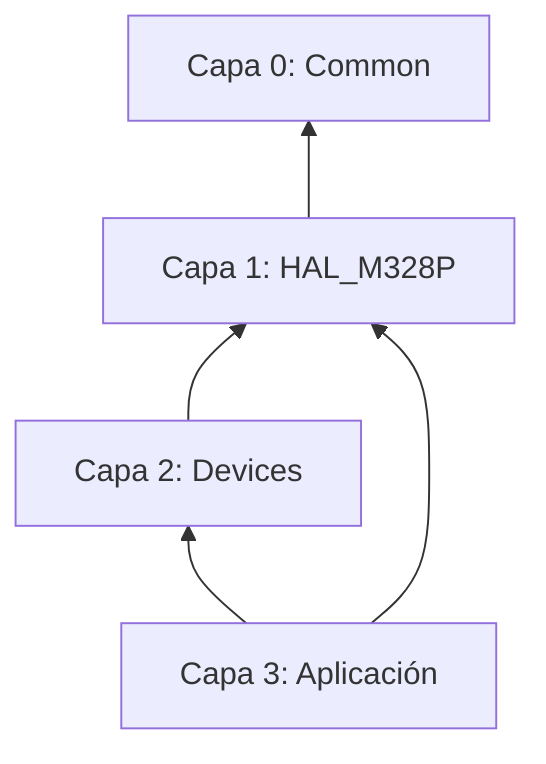

# 📚 Biblioteca de Abstracción de Hardware (libs)

Este directorio centraliza la arquitectura de software del proyecto, dividida en tres niveles de abstracción para garantizar modularidad, portabilidad y reusabilidad.

## 📂 Estructura de la Carpeta

### 1. ⚙️ [common/](./common)
**Capa 0 - Utilidades Universales.** Contiene las definiciones base que se utilizan en todas las capas superiores.
* **`bits.h`**: Macros para manipulación atómica de bits (`SET_BIT`, `CLR_BIT`, `TOGGLE_BIT`, `GET_BIT`). Es el cimiento para el acceso a registros.

### 2. 🏛️ [hal_m328p/](./hal_m328p)
**Capa 1 - Hardware Abstraction Layer (Internal).** Abstracción directa de los periféricos internos del silicio del ATmega328P. Estos drivers manipulan registros específicos del MCU.
* **`gpio/`**: Control de puertos de entrada y salida mediante estructuras de punteros.
* **`timer/`**: Gestión de Systick (T0), generación de frecuencias (T1) y control de sistema (T2).
* **`exti/`**: Configuración de interrupciones externas por flanco.

### 3. 🔌 [devices/](./devices)
**Capa 2 - Device Drivers (External).** Drivers para componentes externos que se conectan al microcontrolador. **No acceden a registros del MCU directamente**, sino que consumen servicios de la `hal_m328p`.
* **`lcd/`**: Driver para displays HD44780 (Modo 4-bits).
* **`step_motor/`**: Lógica de secuenciamiento para motores paso a paso (ULN2003 / 28BYJ-48).

---

## 🛠️ Flujo de Dependencias

Para mantener la integridad de la arquitectura, se debe respetar el siguiente flujo de inclusión de archivos:


### 📝 Estándar de Documentación en Código

Para garantizar la mantenibilidad y profesionalismo del firmware, cada driver debe seguir el formato **Doxygen**. Esto permite que el IDE proporcione ayuda contextual y facilita la trazabilidad técnica:

* **`@file`**: Nombre del archivo.
* **`@brief`**: Descripción corta de la funcionalidad.
* **`@author`**: Autor del código.
* **`@param`**: Explicación de los parámetros de entrada.
* **`@return`**: Descripción del valor de retorno.
* **`@note`**: Advertencias críticas (ej. Secciones críticas, uso de interrupciones).

**Ejemplo de aplicación en archivos `.h` / `.c`:**

```c
/**
 * @file timer.h
 * @brief Driver de Capa 1 para la gestión de Timers del ATmega328P.
 * @author Mamani Flores Carlos
 * * @note Este módulo utiliza secciones críticas para garantizar 
 * la lectura atómica de variables de 32 bits.
 */
```

---

> *"Dominar el silicio no es imponerle órdenes, sino comprender su ritmo para construir drivers que sean promesas de estabilidad; solo así el sistema puede crecer sin miedo al colapso, fluyendo con la precisión de un cristal de cuarzo."*