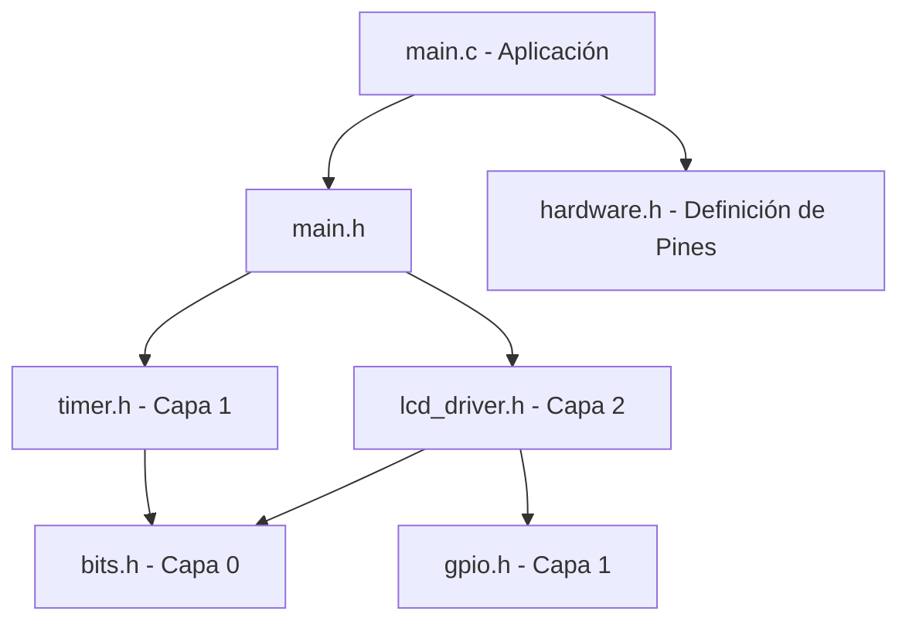
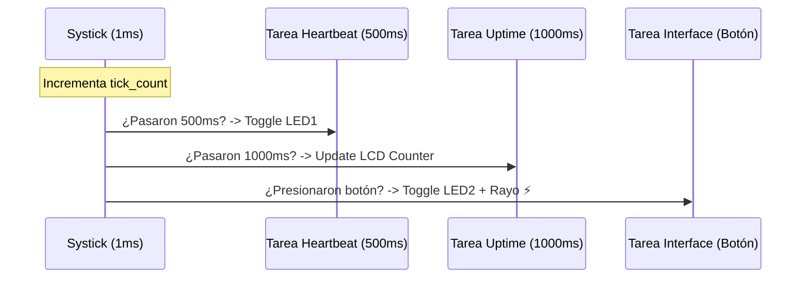

# 📑 Lab 06 - Generic LCD Device Driver & Multitarea Cooperativa

## 🎯 1. Título y Objetivos
**Desarrollo de un Driver de Dispositivo (Capa 2) Independiente y Arquitectura Multitarea No Bloqueante.**

* **Implementar un driver de Capa 2 (Device Driver):** agnóstico al hardware, basado en manipulación directa de registros mediante punteros y la capa `bits.h`.
* **Desacoplar el Driver LCD del Timer:** Los delays de inicialización y protocolo se gestionan de forma interna para dejar el **Timer 0** como recurso exclusivo del Sistema (Systick).
* **Centralización de Hardware:** Implementar `hardware.h` para abstraer el pinout físico de la lógica del driver.
* **Diseñar una interfaz de usuario dinámica:** con cronómetro de sistema y caracteres especiales personalizados (CGRAM).

---

## 📖 2. Teoría de Operación: Systick y Delays Híbridos
El sistema utiliza un enfoque híbrido para optimizar recursos:

* **Systick (Timer 0):** Genera una base de tiempo de **1ms** para la multitarea cooperativa en la Capa 3. Es el responsable del parpadeo del LED (*Heartbeat*) y el cronómetro de segundos.
* **Delays Atómicos (Driver):** El driver LCD utiliza `util/delay.h` calibrado con analizador lógico (**150µs** de pulso de Enable). Esto garantiza que el LCD inicialice correctamente sin importar la carga del Systick, evitando bloqueos por interrupciones concurrentes durante el arranque.

---

## 🏗️ 3. Arquitectura del Software (Multicapa Refactorizada)
El proyecto se organiza bajo una estructura jerárquica estricta:

* **Capa 0 (Common):** Lógica de manipulación de bits (`bits.h`).
* **Capa 1 (HAL):** Abstracción de GPIO y Timer (`gpio.c`, `timer.c`).
* **Capa 2 (Devices):** Driver LCD genérico que recibe punteros a registros.
* **Capa 3 (Aplicación):** Lógica de usuario (`main.c`, `main.h`) y definición de recursos (`hardware.h`).

### Diagrama de Dependencias



---

## 🛡️ 4. Detalles de Robustez y Funcionalidades

### 🧩 Abstracción por hardware.h
Se eliminaron por completo las referencias directas a registros (`PORTB`, `DDRD`, etc.) en el código de aplicación (Capa 3). Todo el mapeo físico se centraliza en `hardware.h` mediante definiciones que apuntan a los objetos `extern` de la Capa GPIO. Esto permite que el firmware sea resiliente a fallas de hardware; si un pin se daña, la reconfiguración se realiza en un único archivo sin afectar la lógica del driver o de la aplicación.

```c
/* Ejemplo de mapeo en hardware.h */
#define LCD_CTRL_PORT    GPIO_B
#define LCD_RS_PIN       0  // PB0
#define LCD_EN_PIN       1  // PB1
```

### ⚡ Driver Basado en bits.h y Punteros
El driver de Capa 2 no depende de las funciones de la Capa 1 para su ejecución interna. Utiliza las macros de `bits.h` directamente sobre punteros `volatile uint8_t*`. Esta técnica garantiza:

* **Atomicidad:** Manipulación de bits sin efectos colaterales en otros pines del puerto.
* **Velocidad:** Acceso directo a memoria sin la sobrecarga (*overhead*) de llamadas a funciones de abstracción durante el protocolo de comunicación.


### ⏱️ Scheduler Cooperativo No Bloqueante
El sistema implementa un *Super-Loop* encargado de ejecutar tres tareas independientes basándose en el conteo de ticks del **Timer 0**:

* **Tarea Heartbeat (PB5):** Indicador visual de ejecución del sistema (Toggle cada 200ms).
* **Tarea Contador (LCD):** Actualización del *Uptime* en segundos en la pantalla, con conversión manual de enteros a ASCII para optimizar el uso de memoria Flash.
* **Tarea Interfaz (Botón):** Monitoreo del pulsador en PD2 con filtro de *Debounce* por software de 200ms, gestionando el estado de un LED de respuesta y la actualización de iconos especiales en el LCD.

#### Diagrama de Tiempo de Tareas

#### Implementación en Capa 3 `(main.c)`

```c
while (1) {
        Task_Heartbeat();
        Task_Contador();
        Task_Boton();
    }
```

```c
void Task_Heartbeat(void) {
    if (get_tick() - t_prev_heartbeat >= 200) {
        GPIO_TogglePin(GPIO_B, 5);
        t_prev_heartbeat = get_tick();
    }
}

void Task_Contador(void) {
    if (get_tick() - t_prev_segundos >= 1000) {
        segundos++;
        LCD_SetCursor(0, 8);
        if (segundos > 99) LCD_WriteChar((segundos / 100) % 10 + '0');
        if (segundos > 9)  LCD_WriteChar((segundos / 10) % 10 + '0');
        LCD_WriteChar((segundos % 10) + '0');
        LCD_Print("s  ");
        t_prev_segundos = get_tick();
    }
}

void Task_Boton(void) {
    if (GPIO_ReadPin(GPIO_D, 2) == GPIO_LOW) {
        if (get_tick() - t_prev_boton >= 200) { // Debounce
            estado_led = !estado_led;
            LCD_SetCursor(1, 8);
            if (estado_led) {
                GPIO_WritePin(GPIO_B, 3, GPIO_HIGH);
                LCD_Print(": ON  ");
                LCD_WriteChar(0); // Rayo
            } else {
                GPIO_WritePin(GPIO_B, 3, GPIO_LOW);
                LCD_Print(": OFF   ");
            }
            t_prev_boton = get_tick();
        }
    }
}

```

* **Debounce por Software:** Filtro de ruido mecánico para el pulsador implementado mediante marcas de tiempo de 200ms, garantizando estabilidad en la lectura de entradas.
* **Pull-up Interna:** Configuración avanzada del pin `INPUT_PULLUP` mediante manipulación directa de registros de puerto, eliminando la necesidad de componentes externos.
* **Optimización de Memoria:** Implementación de un algoritmo de conversión de enteros a ASCII (Uptime) basado en aritmética de divisiones y módulo, evitando el consumo excesivo de memoria Flash de la librería `stdio.h`.
* **CGRAM (Custom Characters):** Generación y uso de un carácter especial personalizado (Rayo ⚡) almacenado en la memoria volátil del controlador LCD para indicar el estado de la carga.

### 🌀 CGRAM (Custom Characters)
Uso de la memoria volátil del controlador LCD para generar caracteres personalizados. Se diseñó un icono de **Rayo (⚡)** mediante un mapa de bits de 5x8, el cual se carga durante la inicialización para representar estados dinámicos en la interfaz de usuario. Esta funcionalidad demuestra el control total sobre el bus de datos al escribir en direcciones de memoria fuera del set de caracteres ASCII estándar.

```c
/* Mapa de bits para el carácter del Rayo (⚡) */
uint8_t char_rayo[] = {
    0b00010, 0b00100, 0b01000, 0b11111,
    0b00100, 0b01000, 0b10000, 0b00000
};
```

---

## 📍 5. Mapeo de Hardware Final

La flexibilidad del driver y la implementación de la Capa 1 (HAL) permiten un mapeo dinámico y centralizado. Para esta versión final, se utilizó la siguiente configuración:

| Componente | Pin Periférico | Pin MCU | Registro HAL (Capa 1) |
| :--- | :--- | :--- | :--- |
| **LCD Control** | RS / EN | PB0 / PB1 | `GPIO_B.PORT` |
| **LCD Datos** | D4 - D7 | PD4 - PD7 | `GPIO_D.PORT` |
| **Pulsador** | Entrada (Pull-up) | PD2 | `GPIO_D.PIN` |
| **LED 1** | Heartbeat | PB5 | `GPIO_B.PORT` |
| **LED 2** | Response (Rayo) | PB3 | `GPIO_B.PORT` |


---

## 📝 6. Conclusión

La integración de `hardware.h` y la refactorización del driver LCD elevan este laboratorio a un estándar industrial. Al independizar el protocolo del LCD del **Timer 0**, se garantiza un arranque robusto del sistema y se libera el *Systick* para tareas de tiempo real críticas. 

La arquitectura multicapa implementada demuestra que es posible crear firmware portable, escalable y mantenible en sistemas *bare-metal*. La eficiencia en la gestión de registros mediante punteros y la abstracción mediante objetos `extern` sientan las bases para el desarrollo de sistemas embebidos profesionales, donde la interactividad y la estabilidad deben coexistir sin colisiones.

---

## 📚 7. Referencias y Documentación

* **Atmel ATmega328P Datasheet:** [Section 13: I/O Ports] y [Section 14: 8-bit Timer/Counter0 with PWM]. 
* **Hitachi HD44780U Datasheet:** [Table 6: Instructions] y [Step 4: Initializing by Instruction].
* **GND-Switching Logic:** Teoría de resistencias Pull-up y lógica negativa en entradas digitales.
* **Micro-Architecture:** Conceptos de Scheduler Cooperativo y Super-Loop en Sistemas Embebidos de Tiempo Real (RTOS base).

---
*"La arquitectura multicapa trasciende la dependencia del silicio: mientras el hardware gestiona los nibbles, el scheduler cooperativo garantiza que la interactividad y el tiempo real coexistan sin colisiones."*
