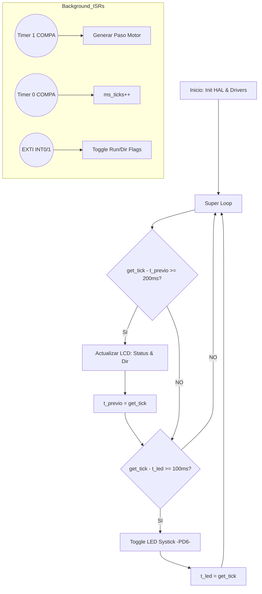

# Lab 08: Orquestación de Múltiples Timers y Control de Eventos para Motor PaP

## 🎯 1. Título y Objetivos
**Título:** Sincronización de Periféricos de Tiempo para el Control de Motores Paso a Paso.  
**Objetivos:**
* Implementar un sistema de **Multitarea Cooperativa** utilizando los tres Timers independientes del ATmega328P.
* Desarrollar un driver de **Capa 2 (Device Driver)** para el motor 28BYJ-48 con soporte para secuencias de pasos en modo Full-Step.
* Integrar una interfaz HMI (LCD + EXTI) que permita el control dinámico de giro y estado sin afectar el torque ni la precisión del motor.

---

## 📖 2. Teoría de Operación (Triple Timer Orquestration)

En este proyecto, el desafío radica en la concurrencia. No basta con responder a un evento; el microcontrolador debe mantener un tren de pulsos constante para el motor mientras gestiona una base de tiempo de sistema y una interfaz visual.

### El Triunvirato de Hardware
Hemos asignado roles específicos a cada periférico para maximizar la eficiencia del silicio:
1. **Timer 0 (Systick - 8 bits):** Configurado en modo **CTC** para generar una interrupción cada **1ms**. Actúa como el latido del sistema para la gestión de retardos no bloqueantes (`get_tick`).
2. **Timer 1 (Stepper Control - 16 bits):** El motor requiere precisión de microsegundos para evitar la pérdida de pasos. Su alta resolución permite ajustar la velocidad con granularidad fina.
3. **Timer 2 (Heartbeat - 8 bits):** Dedicado exclusivamente a la señalización visual del estado del CPU, garantizando que el "latido" sea independiente de la carga de procesamiento del LCD.

### Gestión de Eventos por EXTI (INT0 e INT1)
A diferencia de laboratorios anteriores, aquí duplicamos la apuesta por el hardware:
* **INT0 (Pin PD2):** Dispara un cambio de estado en la variable volátil `motor_running` (Play/Stop).
* **INT1 (Pin PD3):** Conmuta el sentido de giro entre horario (CW) y antihorario (CCW).

---

## 🏗️ 3. Arquitectura del Software (Modelo de 3 Capas)

El firmware implementa un desacoplamiento total. El `main.c` no conoce la implementación física de los pines; solo orquesta servicios mediante una estructura jerárquica.

### Diagrama de Flujo del Sistema

### Detalle de Capas

#### 🔹 Capa 1: HAL Multi-Periférico (`gpio.c`, `systick.c`, `exti.c`)
La **Capa 1** gestiona la totalidad de los recursos del chip. Se destaca el uso de **Secciones Críticas** en `get_tick()`, donde se deshabilita temporalmente el bit I del `SREG` para asegurar que la lectura de la variable de 32 bits no sea corrompida por una interrupción a mitad de ciclo (**lectura atómica**).

#### 🔹 Capa 2: Device Drivers (`step_motor_28BYJ48.c`, `lcd_driver.c`)
* **Stepper Driver:** Implementa una máquina de estados que recorre la tabla de fases. El uso de interrupciones garantiza que el torque se mantenga constante al asegurar una base de tiempo determinística.
* **LCD Driver (4-bit):** Optimizado para la **independencia de puertos** mediante escritura bit a bit. Esto permite el uso de pines distribuidos en diferentes puertos físicos (remapeado estratégicamente a **PORTC** para este proyecto para evitar ruidos de conmutación).

#### 🔹 Capa 3: Aplicación (`main.c`)
La aplicación funciona como un **Scheduler de tiempo real**. El uso de **aritmética circular** garantiza que tareas como el refresco del LCD y el parpadeo del LED de estado no bloqueen el CPU, permitiendo que las ISR (Rutinas de Servicio de Interrupción) críticas se ejecuten con prioridad absoluta.

### ⚙️ 3.1. Configuración y Portabilidad (The Header Strategy)

Para garantizar que el sistema sea mantenible y escalable, hemos implementado una **doble capa de abstracción** mediante archivos de cabecera específicos:

* **`hw_project_08.h` (El Contrato Físico):** Centraliza el mapeo de pines y puertos. Si el motor se mueve a otro puerto para optimizar el ruteo de la PCB, el desarrollador solo modifica este archivo. Aquí también se definen los **Parámetros de Tiempo Críticos** (como los *Ticks* de velocidad del motor), permitiendo tunear el rendimiento del hardware sin alterar la lógica algorítmica de las capas superiores.
* **`main_project_08.h` (El Director de Orquesta):** Define la lógica de negocio y las constantes del *Scheduler* cooperativo. Aquí se ajustan los tiempos de refresco de la HMI y las cadencias de los LEDs de estado. Este archivo actúa como el nexo entre los *Drivers* de **Capa 2** y la Aplicación de **Capa 3**, eliminando por completo los "números mágicos" dentro del código fuente principal.

---

### 🛡️ 4. Detalles de Robustez

* **Filtrado de Transitorios:** Se implementó una red de desacoplo con capacitores electrolíticos (**220µF**) en la etapa de potencia y cerámicos (**100nF**) en la etapa digital para mitigar el ruido de conmutación inductiva del motor.
* **Manejo de Flags Volátiles:** Todas las variables compartidas entre las ISR y el bucle principal están calificadas como `volatile`, evitando optimizaciones del compilador que ignorarían cambios de estado producidos por el hardware.
* **Debounce por Hardware:** El uso de interrupciones externas se complementa con filtrado físico para evitar disparos espurios causados por el rebote mecánico de los pulsadores.
* **Aislamiento de Configuración:** Al separar las definiciones de hardware (`hw_project`) de la lógica de aplicación, se mitigan los errores de "efectos colaterales". Un cambio en la asignación de pines del LCD no puede corromper accidentalmente la lógica de control del motor, ya que las dependencias están estrictamente compartidas a través de tipos de datos y estructuras de configuración bien definidas.

---

### 📍 5. Mapeo de Hardware

| Periférico | Pin | Puerto | Definición en Header (Capa 1) | Función |
| :--- | :--- | :--- | :--- | :--- |
| **Motor (IN1)** | PB0 | GPIO_B | `M1_IN1_PIN` | Control de Fase A |
| **Motor (IN2)** | PB1 | GPIO_B | `M1_IN2_PIN` | Control de Fase B |
| **Motor (IN3)** | PB2 | GPIO_B | `M1_IN3_PIN` | Control de Fase C |
| **Motor (IN4)** | PB4 | GPIO_B | `M1_IN4_PIN` | Control de Fase D |
| **Botón Start** | PD2 | GPIO_D | `BTN_START_STOP` | Toggle Play/Stop (EXTI0) |
| **Botón Dir** | PD3 | GPIO_D | `BTN_DIR` | Toggle Dirección (EXTI1) |
| **LED Heartbeat**| PB3 | GPIO_B | `LED_BREATH` | Estado Timer 2 (OC2A) |
| **LED Systick** | PD6 | GPIO_D | `LED_SYS_PIN` | Testigo de Base de Tiempo |
| **LCD RS** | PC0 | GPIO_C | `LCD_RS_PIN` | Register Select |
| **LCD EN** | PC1 | GPIO_C | `LCD_EN_PIN` | Enable Signal |
| **LCD D4-D7** | PC2-5| GPIO_C | `LCD_D4_PIN` a `LCD_D7_PIN` | Bus de Datos (4-bits) |

---

### 🏁 6. Conclusión

El **Proyecto 08** representa la madurez en el desarrollo *Bare-Metal*. La capacidad de orquestar múltiples timers e interrupciones externas para controlar carga de potencia y comunicación visual simultáneamente, sienta las bases para el desarrollo de sistemas de control industrial y robótica móvil avanzada, donde el **determinismo temporal** es la prioridad absoluta.

---

### 📖 7. Referencias

* **Atmel Corporation.** *ATmega328P Datasheet*. Secciones: 13 (EXTI), 14 (Timer0), 15 (Timer1) y 17 (Timer2).
* **CarlitozMF (2026).** *Modular Stepper Library for AVR*. Capa 2: Sequential Step Implementation.
* **LCD Controller HD44780.** *Instruction Set & 4-bit Initialization Sequence*.

---

*"En el diseño de firmware, la verdadera elegancia no es hacer muchas cosas a la vez, sino hacer que cada una ocurra exactamente cuando debe, sin que las otras se enteren."*