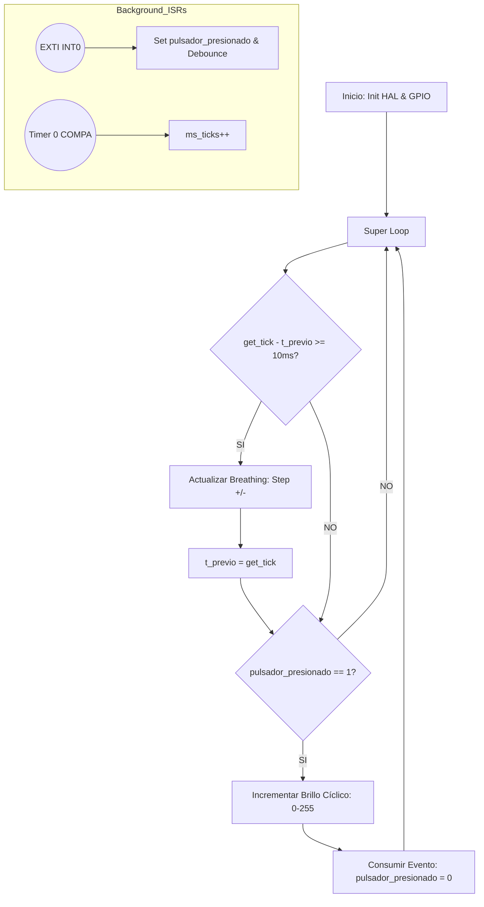

# Lab 09: Orquestación de Timers para Control de Iluminación Dinámica y Eventos Asíncronos

## 🎯 1. Título y Objetivos
**Título:** Sincronización de Periféricos de Tiempo para el Control de Brillo PWM y Gestión de Eventos por EXTI.  
**Objetivos:**
* Implementar un sistema de **Multitarea Cooperativa** utilizando los Timers independientes del ATmega328P para evitar bloqueos del CPU.
* Desarrollar una Capa 1 (HAL) de PWM robusta que solucione el "glitch" del ciclo mínimo mediante desconexión dinámica.
* Integrar una interfaz de usuario reactiva (EXTI) que permita el control dinámico de niveles de brillo sin interferir con la fluidez del efecto *Breathing*.

---

## 📖 2. Teoría de Operación (Dual Timer Orchestration)

En este proyecto, la eficiencia se logra mediante el determinismo. El microcontrolador gestiona un efecto visual suave (analógico-simulado) mientras responde instantáneamente a estímulos táctiles del usuario.

### El Binomio de Hardware
Hemos asignado roles estratégicos a los periféricos para garantizar que la carga de procesamiento no afecte la experiencia visual:
1. **Timer 0 (Systick - 8 bits):** Configurado en modo **CTC** para generar una interrupción cada **1ms**. Actúa como el latido del sistema para la gestión de retardos no bloqueantes (`get_tick`) y el *debounce* de pulsadores.
2. **Timer 2 (PWM Control - 8 bits):** Configurado en modo **Fast PWM** con un prescaler de 64. Provee dos canales de salida independientes (OC2A y OC2B) para el control de potencia de los LEDs, permitiendo frecuencias de conmutación de ~976 Hz, imperceptibles al ojo humano.

### Gestión del "Cero Real"
Dado que el modo Fast PWM de AVR produce un pulso residual incluso con `OCR2x = 0`, se implementó una **Máquina de Estado de Pin**:
* Al detectar un Duty del 0%, el software invoca `Timer2_PWM_Fast_DisableChannel`, rompiendo la unión física entre el Timer y el pin.
* Se fuerza el pin a `LOW` mediante el driver GPIO, garantizando un apagado absoluto y profesional del LED.

---

## 🏗️ 3. Arquitectura del Software (Modelo de 3 Capas)

El firmware implementa un desacoplamiento total. El uso de punteros volátiles y estructuras en la Capa 1 asegura que la aplicación de Capa 3 sea agnóstica a la manipulación de registros.

### Diagrama de Flujo del Sistema

### 🏗️ Detalle de Capas

#### 🔹 Capa 1: HAL Multi-Periférico (`gpio.c`, `systick.c`, `timer2_fast_pwm.c`, `exti.c`)
La **Capa 1** gestiona la integridad del hardware. Se destaca la integración de `gpio.h` dentro de los drivers de los Timers, permitiendo que la habilitación de un canal PWM configure automáticamente el sentido del pin (`DDR`) sin intervención del usuario en niveles superiores.

#### 🔹 Capa 2: Hardware Mapping & Application Bridge (`hw_project_09.h`)
Esta capa actúa como el **"Contrato de Hardware"**. Define los alias de los pines y canales de PWM, permitiendo que el proyecto sea migrado a otros pines simplemente modificando el archivo de cabecera, manteniendo intacta la lógica de la aplicación.

#### 🔹 Capa 3: Aplicación (`main.c`)
La aplicación funciona como un **Scheduler cooperativo**. Utiliza la aritmética de `get_tick()` para ejecutar la tarea de respiración en intervalos precisos, mientras que el control del pulsador se maneja de forma asíncrona mediante el flag de evento generado por la interrupción externa.

---

### 🛡️ 4. Detalles de Robustez

* **Secciones Críticas:** La lectura del contador de milisegundos en `get_tick()` utiliza un respaldo del registro `SREG` y deshabilitación de interrupciones para garantizar la **atómica de 32 bits** en un bus de 8 bits.
* **Manejo de Flags Volátiles:** La variable `pulsador_presionado` está calificada como `volatile`, asegurando que el bucle principal siempre lea el valor actualizado por la ISR de EXTI.
* **Debounce por Software:** Se implementó un filtro temporal de **200ms** dentro de la ISR, evitando disparos múltiples por el rebote mecánico de los pulsadores.
* **Pull-up Interno:** Se activa la resistencia de Pull-up mediante software, simplificando el diseño de hardware al requerir solo el pulsador conectado a GND.

---

### 📍 5. Mapeo de Hardware

| Periférico | Pin Físico | Definición en Header | Función |
| :--- | :--- | :--- | :--- |
| **Timer 2 (OC2A)** | PB3 (Pin 11) | `LED_BREATH_CH` | Salida PWM LED Respiración |
| **Timer 2 (OC2B)** | PD3 (Pin 3) | `LED_PULSE_CH` | Salida PWM LED Pulsador |
| **EXTI 0** | PD2 (Pin 2) | `BUTTON_PIN` | Entrada Pulsador (INT0) |
| **Timer 0** | N/A | `SYSTICK_TIMER` | Generación de Tick de 1ms |

---

### 🏁 6. Conclusión

El **Proyecto 09** demuestra la madurez de la arquitectura de capas desarrollada. La capacidad de controlar señales PWM con corrección de errores de hardware (glitch del ciclo cero) junto con una respuesta inmediata a eventos externos, proporciona un control fluido y profesional. La separación de responsabilidades entre el Systick y el PWM Timer permite un escalado futuro hacia drivers de potencia más complejos.

---

*"En el diseño de firmware, la verdadera elegancia del Fast PWM no es solo conmutar estados a alta velocidad, sino lograr que cada ciclo de trabajo entregue la energía exacta, en el instante preciso, mientras el CPU fluye sin interrupciones."*