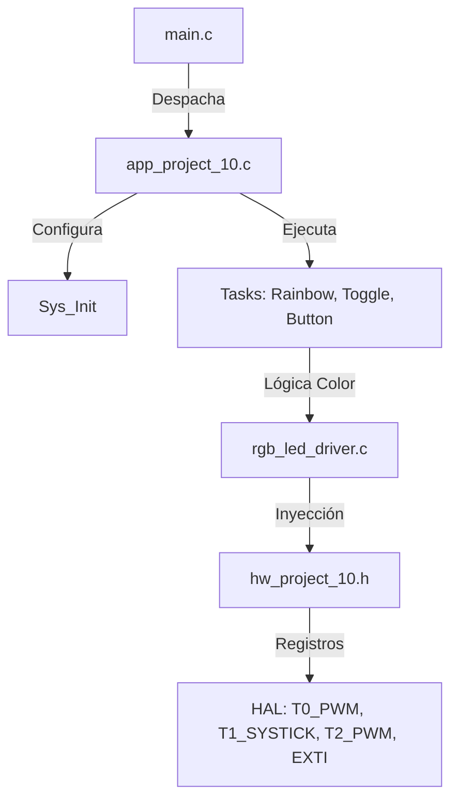

# Proyecto 10: Motor de Efectos RGB y Gestión de Eventos EXTI bajo Arquitectura de 4 Capas

## 1. Título y Objetivos
**Control de Iluminación Multitarea: RGB Rainbow, User Dimmer y Systick.**

* **Objetivo 1:** Implementar un sistema de tareas cooperativas utilizando el **Timer 1** como base de tiempo (**Systick**), eliminando el uso de retardos bloqueantes (`_delay_ms`).
* **Objetivo 2:** Dominar la generación de múltiples señales **Fast PWM** concurrentes en el **Timer 0** y **Timer 2**.
* **Objetivo 3:** Gestionar eventos asincrónicos mediante interrupciones externas (**EXTI**) con debouncing por software.
* **Objetivo 4:** Aplicar una arquitectura modular de 4 capas para garantizar la portabilidad y el mantenimiento del firmware.

---

## 2. Teoría de Operación

### Gestión de Timers (Maestro/Esclavo)
El sistema explota los recursos de hardware del ATmega328P de forma diversificada:
* **Timer 1 (Maestro de Tiempo):** Configurado en modo **CTC** para generar una interrupción exacta cada 1ms (**Systick**). Actúa como el motor de sincronización para todas las tareas de la Capa de Aplicación.
* **Timer 0 & 2 (Generadores de Potencia):** Configurados en modo **Fast PWM** con un prescaler de 64. 
    * El **Timer 0** gestiona los canales Rojo (OC0A) y Verde (OC0B).
    * El **Timer 2** orquesta el canal Azul (OC2A) y el LED de usuario independiente (OC2B).

### Interrupción Externa (EXTI) y Pull-up Interno
El pulsador de usuario está conectado al pin **PD2 (INT0)** en configuración **Active-Low**. Se utiliza la resistencia de **Pull-up interna** y se configura el disparo por **flanco de bajada (Falling Edge)**.
* **Debouncing por Software:** Se implementa un filtro temporal de 200ms en la ISR, comparando los ticks actuales del sistema para ignorar rebotes mecánicos sin bloquear el CPU.

---

## 3. Arquitectura del Software (4 Capas)

Se implementó una división estricta de responsabilidades para asegurar que el código sea testeable y mantenible:

1. **Capa 1 (HAL / Hardware Mapping):** Definida en `hw_project_10.h`. Contiene los wrappers `static inline` que traducen llamadas genéricas a registros específicos, como asi tambien las definiciones de hardware necesarias.
2. **Capa 2 (Drivers de Dispositivo):** `rgb_led_driver.c`. Maneja la lógica pura de color (ánodo/cátodo común). Recibe las funciones de hardware por inyección de dependencias.
3. **Capa 3 (Aplicación):** `app_project_10.c`. Implementa las máquinas de estado del efecto Rainbow, la lógica del Dimmer manual (Bottom-Half processing) y el Heartbeat.
4. **Capa 4 (Main):** `main.c`. Orquestador mínimo que inicializa los servicios y despacha las tareas concurrentes.

---

## 4. Detalles de Robustez

* **Uso de volatile:** La bandera `pulsador_presionado` está declarada con el calificador `volatile`. Esto es crítico para informar al compilador que su valor puede ser modificado por un evento asincrónico (la ISR), evitando optimizaciones que podrían ignorar los cambios de estado en el bucle principal.
* **Casting de Precisión:** En los cálculos de la máquina de estados del Rainbow, se aplica un casting explícito a `uint16_t` antes de realizar sumas de intensidad. Esto previene desbordamientos de 8 bits (overflow) que causarían parpadeos visuales indeseados al superar el límite de 255.
* **Safe State:** En la tarea del botón, al alcanzar el nivel de brillo cero, el sistema no solo carga un duty cycle de 0, sino que **desactiva físicamente el canal PWM** y fuerza el pin a `LOW` mediante GPIO. Esto garantiza un estado de apagado total, eliminando cualquier posible fuga de corriente o jitter en el pin.

---

## 5. Mapeo de Hardware

| Periférico | Pin AVR | Función Lógica | Modo de Operación |
| :--- | :--- | :--- | :--- |
| **LED RGB (R)** | PD6 | OC0A | Fast PWM (Timer 0) |
| **LED RGB (G)** | PD5 | OC0B | Fast PWM (Timer 0) |
| **LED RGB (B)** | PB3 | OC2A | Fast PWM (Timer 2) |
| **LED Dimmer** | PD3 | OC2B | Fast PWM (Timer 2) |
| **Pulsador** | PD2 | INT0 | EXTI (Pull-up Interno) |
| **System LED** | PB0 | GPIO | Toggle (Heartbeat) |
| **Base Tiempo** | N/A | Systick | CTC (Timer 1) |

---

## 6. Conclusión

Este proyecto consolida el diseño de sistemas embebidos profesionales mediante el uso de **Systick** y **multitarea cooperativa**. La implementación exitosa de una arquitectura de software por capas permite que el firmware sea altamente escalable y mantenible. Se demuestra que, incluso en un microcontrolador de recursos limitados como el ATmega328P, es posible gestionar múltiples eventos de tiempo, interrupciones externas y señales de potencia de forma simultánea, garantizando la estabilidad y robustez del sistema en todo momento.

---

*"Dominar el Fast PWM no es solo modular energía; es la capacidad de convertir registros de hardware en un lienzo de colores, orquestados por un driver que ignora el silicio pero entiende la luz."*