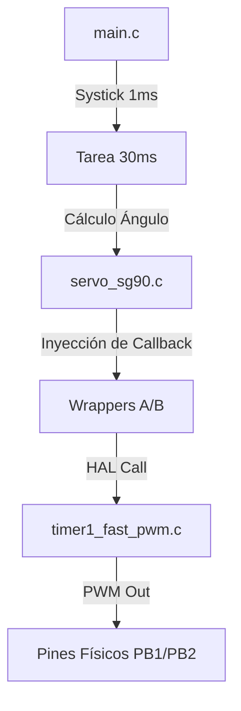

# Proyecto 11: Control de Servomotores SG90 y Arquitectura de Control de 16-bits

## 1. Título y Objetivos
**Movimiento Angular de Precisión: PWM de Alta Resolución, Wrappers de Hardware y Gestión de Carga.**

* **Objetivo 1:** Implementar el control de servomotores utilizando el **Timer 1** en modo **Fast PWM de 16 bits**, logrando una resolución de **0.5µs** por tick.
* **Objetivo 2:** Desarrollar un driver de servo genérico basado en **instancias y callbacks**, permitiendo el control de múltiples motores con un solo driver.
* **Objetivo 3:** Sincronizar tareas de actualización angular mediante un **Systick de 1ms** basado en el Timer 0.
* **Objetivo 4:** Resolver problemas de integridad de señal y ruido electromagnético (EMI) mediante técnicas de **filtrado capacitivo** y **estabilización de VCC**.

---

## 2. Teoría de Operación

### PWM de 16 bits vs 8 bits
A diferencia de los LEDs RGB (Proyecto 10), los servos requieren un pulso de gran precisión (entre 1ms y 2ms en una ventana de 20ms). 
* **Timer 1 (Generador de Señal):** Configurado en **Modo 14 (Fast PWM con TOP en ICR1)**. Con un prescaler de 8 y un TOP de 39,999, obtenemos una frecuencia exacta de **50Hz**. 
* **Resolución:** Al usar 16 bits, el rango de movimiento de 180° se reparte en miles de pasos (ticks), eliminando el movimiento "escalonado" de los drivers de 8 bits.

### El Desafío de la Carga Inductiva
Los servomotores son cargas inductivas que generan picos de corriente significativos al arrancar o cambiar de dirección. 
* **Filtrado:** Se implementó un esquema de desacople con capacitores electrolíticos para compensar el *voltage sag* y cerámicos (100nF) para filtrar el ruido de alta frecuencia de la fuente conmutada.

---

## 3. Arquitectura del Software (Capas Modulares)

El firmware se diseñó para ser totalmente independiente del hardware, facilitando la migración a otros microcontroladores.

1. **Capa 1 (HAL):** `timer1_fast_pwm.c`. Manejo de registros de 16 bits (`ICR1`, `OCR1A/B`); `systick.c`: manejo de timer 0 para ticks de 1ms.
2. **Capa 1.5 (Hardware Mapping):** Localizada en el `main.c`. Define los **Wrappers** que conectan el driver de servo con el timer físico.
3. **Capa 2 (Device Driver):** `servo_sg90.c`. Implementa la lógica de mapeo angular y la estructura `Servo_t`. Recibe funciones de escritura por **Inyección de Dependencias**.
4. **Capa 3 (Aplicación/Main):** `main.c`. Gestiona el barrido síncrono/asíncrono de los servos y la base de tiempo Systick.

---

## 4. Detalles de Robustez

* **Secciones Críticas (Atomicidad):** Se implementó protección mediante el guardado del registro de estado `SREG` y deshabilitación temporal de interrupciones (`cli()`) en la lectura del Systick de 32 bits y en la escritura de registros de 16 bits. Esto garantiza que el valor de 16 bits no sea corrompido por una interrupción a mitad de la escritura (systick).
* **Sincronización de Arranque:** Se modificó la inicialización del driver para arrancar en **0° (Safe Start)**, eliminando el "pataleo" mecánico que ocurría al saltar desde el valor por defecto (90°) hacia el primer comando de la aplicación.
* **Manejo de Underflow:** Uso de tipos de datos con signo (`int8_t`) para el paso de ángulo y lógica de saturación para evitar que el desbordamiento de variables `uint8_t` cause saltos erráticos en el servo al intentar bajar de 0.

---

## 5. Mapeo de Hardware

| Periférico | Pin AVR | Función Lógica | Configuración |
| :--- | :--- | :--- | :--- |
| **Servo 1** | PB1 | OC1A | PWM 16-bits (Canal A) |
| **Servo 2** | PB2 | OC1B | PWM 16-bits (Canal B) |
| **Systick** | N/A | Timer 0 | CTC @ 1ms |
| **Power Source** | VCC/GND | Externa 5V 4A | Fuente Switching + Capacitores |

---

## 6. Conclusión

El Proyecto 11 demuestra que el control de movimiento robusto requiere un equilibrio perfecto entre **precisión digital** y **estabilidad analógica**. La arquitectura por capas permitió abstraer la complejidad del Timer 1 de 16 bits, mientras que la resolución de problemas eléctricos mediante hardware (capacitores) garantizó la operatividad del sistema bajo carga. Este módulo de control servomotor queda listo para integrarse en plataformas robóticas de mayor envergadura.

---

*"Control de precisión mediante PWM de 16 bits y drivers modulares, optimizado para entornos con alta demanda de corriente y ruido electromagnético."*