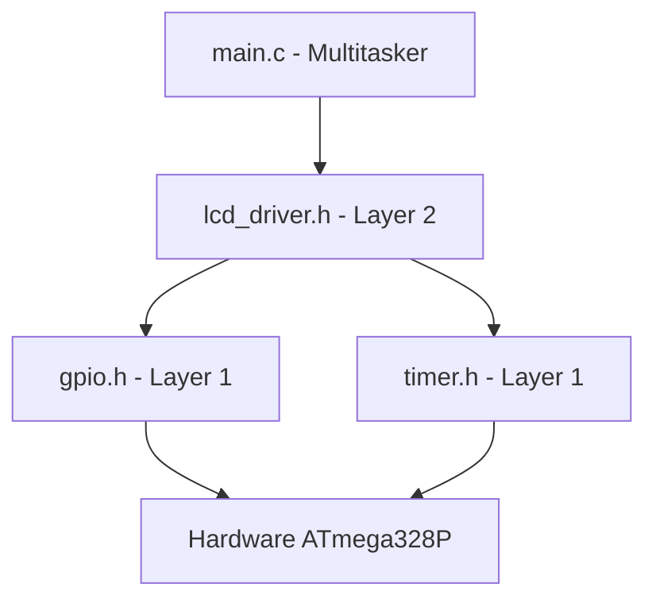
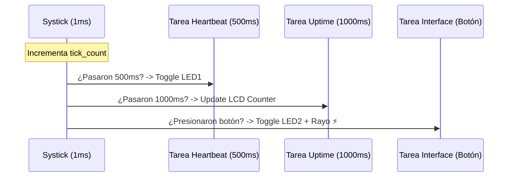

# Lab 06 - Generic LCD Device Driver & Multitarea Cooperativa

## 🎯 1. Título y Objetivos
**Desarrollo de un Driver de Dispositivo (Capa 2) y Arquitectura Multitarea No Bloqueante.**

* **Implementar un driver de Capa 2 (Device Driver)** agnóstico al hardware para LCD HD44780.
* **Desarrollar un Scheduler Cooperativo** básico en el `main.c` para gestionar múltiples tareas en paralelo.
* **Integrar el control de periféricos lentos (LCD)** con entradas críticas (Botones) mediante el sistema Systick.
* **Diseñar una interfaz de usuario dinámica** con pantalla de bienvenida, cronómetro de sistema y caracteres especiales (CGRAM).

---

## 📖 2. Teoría de Operación: Multitarea Cooperativa
En este proyecto se abandona el paradigma de programación lineal. El sistema utiliza un **Super-Loop con Tareas Basadas en Tiempo** para simular paralelismo:

* **Systick (Reloj Maestro):** El Timer 0 genera una base de tiempo de 1ms mediante interrupciones.
* **Non-Blocking Polling:** En lugar de usar `delay()`, el `main.c` consulta constantemente el tiempo transcurrido para cada tarea independiente. Esto permite que el microcontrolador atienda el botón al instante mientras el LED parpadea (Heartbeat) y el LCD actualiza el cronómetro en tiempo real.

---

## 🏗️ 3. Arquitectura del Software (Multicapa)
El código se organiza en capas para facilitar la portabilidad a otros AVR (como el ATtiny85):

1.  **Capa 0 (Common):** Gestión de bits a bajo nivel (`bits.h`).
2.  **Capa 1 (HAL):** Control de periféricos internos (`gpio.c`, `timer.c`).
3.  **Capa 2 (Devices):** Protocolo del LCD (`lcd_driver.c`).
4.  **Capa 3 (Aplicación):** Lógica multitarea en `main.c`.

### Diagrama de Dependencias



---

## 🛡️ 4. Detalles de Robustez y Funcionalidades

* **Scheduler Cooperativo:** Tres tareas paralelas (Heartbeat, Uptime Counter e Interface) ejecutándose de forma concurrente sin interferencias mediante gestión de tiempos no bloqueantes.

#### Diagrama de Tiempo de Tareas


#### Implementación en Capa 3 `(main.c)`

```c

while (1) {
    // Tarea 1: Heartbeat (Independiente)
    if (get_tick() - t_previo_heartbeat >= 500) {
        GPIO_TogglePin(GPIO_B, 5);
        t_previo_heartbeat = get_tick();
    }

    // Tarea 2: Contador de Segundos (Independiente)
    if (get_tick() - t_previo_segundos >= 1000) {
        actualizar_uptime_lcd();
        t_previo_segundos = get_tick();
    }

    // Tarea 3: Atención del Boton Pulsador (Independiente)
    if (GPIO_ReadPin(GPIO_D, 2) == GPIO_LOW) {
        if (get_tick() - t_previo_boton >= 200) {
            estado_led = !estado_led;
            LCD_SetCursor(1, 8);
            if (estado_led) {
                GPIO_WritePin(GPIO_B, 3, GPIO_HIGH);
                LCD_Print(": ON  ");
                LCD_WriteChar(0); // Imprimimos el rayo (carácter 0)
                } else {
                    GPIO_WritePin(GPIO_B, 3, GPIO_LOW);
                    LCD_Print(": OFF   "); // Espacios para borrar el rayo
                }
                t_previo_boton = get_tick();
            }
        }
}

```

* **Debounce por Software:** Filtro de ruido mecánico para el pulsador implementado mediante marcas de tiempo de 200ms, garantizando estabilidad en la lectura de entradas.
* **Pull-up Interna:** Configuración avanzada del pin `INPUT_PULLUP` mediante manipulación directa de registros de puerto, eliminando la necesidad de componentes externos.
* **Optimización de Memoria:** Implementación de un algoritmo de conversión de enteros a ASCII (Uptime) basado en aritmética de divisiones y módulo, evitando el consumo excesivo de memoria Flash de la librería `stdio.h`.
* **CGRAM (Custom Characters):** Generación y uso de un carácter especial personalizado (Rayo ⚡) almacenado en la memoria volátil del controlador LCD para indicar el estado de la carga.

---

## 📍 5. Mapeo de Hardware
La flexibilidad del driver permite un mapeo dinámico. Para el **Laboratorio 06** se utilizó la siguiente configuración:

| Componente | Pin Periférico | Pin MCU | Función |
| :--- | :--- | :--- | :--- |
| **LCD** | RS / EN | PB0 / PB1 | Control de Bus |
| **LCD** | D4 - D7 | PD4 - PD7 | Datos (Modo 4-bits) |
| **Pulsador** | - | PD2 | Entrada (Pull-up) |
| **LED 1** | - | PB5 | Heartbeat (Tarea 1) |
| **LED 2** | - | PB3 | Respuesta (Tarea 3) |

---

## 📝 6. Conclusión
El **Lab 06** marca un hito en el portfolio al demostrar que la potencia de un firmware no reside solo en el hardware, sino en la **arquitectura del software**. El uso de un diseño multitarea cooperativa permite que el sistema sea escalable, eficiente y sumamente reactivo. Este desarrollo sienta las bases técnicas para proyectos de mayor complejidad, como el manejo de interrupciones externas (**EXTI**) o implementaciones de comunicaciones seriales (**UART**).

---

## 📚 7. Referencias y Documentación

* **Atmel ATmega328P Datasheet:** [Section 13: I/O Ports] y [Section 14: 8-bit Timer/Counter0 with PWM]. 
* **Hitachi HD44780U Datasheet:** [Table 6: Instructions] y [Step 4: Initializing by Instruction].
* **GND-Switching Logic:** Teoría de resistencias Pull-up y lógica negativa en entradas digitales.
* **Micro-Architecture:** Conceptos de Scheduler Cooperativo y Super-Loop en Sistemas Embebidos de Tiempo Real (RTOS base).

---
*"La arquitectura multicapa trasciende la dependencia del silicio: mientras el hardware gestiona los nibles, el scheduler cooperativo garantiza que la interactividad y el tiempo real coexistan sin colisiones."*