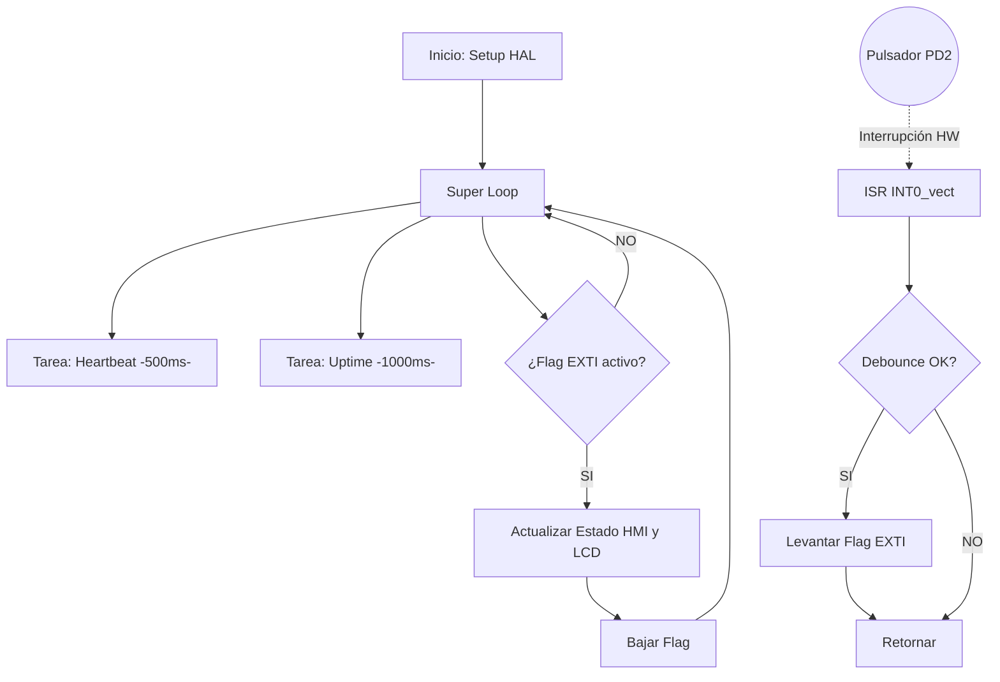

# Lab 07: EXTI Event-Driven HAL & Atomic Debounce

## 🎯 1. Título y Objetivos
**Título:** Implementación de Interrupciones Externas (EXTI) y Gestión de Eventos No Bloqueantes.  
**Objetivos:**
* Migrar de un modelo de *Polling* (consulta constante) a un modelo **Orientado a Eventos** por Hardware.
* Desarrollar una Capa 1 (HAL) genérica y reutilizable para la gestión de interrupciones `INTx`.
* Implementar un filtro de **Debounce Atómico** basado en el motor de Systick para eliminar el ruido mecánico de los pulsadores sin bloquear el CPU.

---

## 📖 2. Teoría de Operación (EXTI & Registros de Control)

En este laboratorio, el microcontrolador delega la vigilancia del pin **PD2 (INT0)** al hardware periférico. El CPU queda liberado para procesar tareas de aplicación y solo es "interrumpido" cuando ocurre un evento físico real. Esta lógica se centraliza en `exti.c`, donde manipulamos los registros específicos del controlador de interrupciones externas.

### Canales de Interrupción Externa
Es fundamental destacar que el ATmega328P cuenta con **dos líneas de interrupción externa dedicadas** (Puras), que ofrecen la mayor velocidad de respuesta y flexibilidad de configuración en todo el chip:
* **INT0 (Pin PD2):** La línea utilizada en este proyecto para el pulsador principal.
* **INT1 (Pin PD3):** Una segunda línea independiente, ideal para sensores de alta frecuencia o encoders.

Ambas líneas poseen vectores de interrupción únicos (`INT0_vect` e `INT1_vect`), lo que permite un procesamiento determinístico sin necesidad de escaneo de pines por software.


### Gestión de Registros en `exti.c`
Para lograr un comportamiento orientado a eventos, el driver configura los siguientes registros críticos:

1. **EICRA (External Interrupt Control Register A):** Es el registro encargado de definir el **sentido del disparo** (Sense Control). En nuestra implementación, configuramos los bits `ISC01` e `ISC00` para detectar un **flanco de bajada** (Falling Edge). Esto permite que la interrupción se dispare exactamente cuando el pulsador conecta el pin a GND.

2. **EIMSK (External Interrupt Mask Register):** Funciona como el "interruptor local". Al setear el bit `INT0`, habilitamos específicamente la línea de interrupción del pin PD2. Sin este bit activo, el hardware ignoraría cualquier evento eléctrico.

3. **SREG (Status Register - Bit I):** Es el interruptor maestro global. Mediante la instrucción `sei()`, permitimos que el sistema responda a las interrupciones habilitadas.


### El Desafío del Rebote (Debounce)
Los pulsadores mecánicos generan ruidos eléctricos (oscilaciones) al cerrarse. En un sistema de interrupciones, la velocidad de respuesta es tan alta que detectaría estas oscilaciones como múltiples pulsaciones legítimas, disparando la ISR decenas de veces por un solo clic.

**Solución en Software:** Implementamos una "ventana de tiempo" de **200ms**. Al ocurrir el primer disparo, la ISR consulta el Systick; si el tiempo transcurrido desde el último evento válido es menor al umbral, el software ignora el ruido. Esto garantiza estabilidad total sin usar capacitores externos ni bloquear el CPU con `_delay_ms()`.

---

## 🏗️ 3. Arquitectura del Software (Modelo de 3 Capas)

El firmware se ha estructurado siguiendo un modelo de abstracción que separa el hardware del flujo lógico, garantizando que el sistema sea escalable y fácil de mantener.

### Diagrama de Flujo del Sistema


#### 🔹 Capa 1: HAL EXTI (`exti.c`) - Abstracción de Hardware
La **Capa 1** es estrictamente genérica y manipula los registros de bajo nivel. Su función es traducir los parámetros de software en configuraciones de silicio sin conocer la aplicación final.

* **Configuración Atómica:** Utiliza máscaras de bits para modificar `EICRA` sin afectar otras líneas.
* **Habilitación Selectiva:** Activa la máscara en `EIMSK` solo para la línea requerida.

```c
/**
 * @brief Inicialización Genérica de EXTI
 * Configura el sentido del disparo y habilita la máscara local.
 */
void EXTI_Init(exti_line_t line, exti_trigger_t trigger) {
    if (line == EXTI_INT0) {
        // Limpiar y configurar bits de sentido (ISC01, ISC00)
        EICRA = (EICRA & ~((1 << ISC01) | (1 << ISC00))) | (trigger << ISC00);
        // Habilitar máscara de interrupción local
        SET_BIT(EIMSK, INT0);
    }
    sei(); // Habilitación global de interrupciones
}
```

#### 🔹 **Capa 2: Interface Driver (`lcd_driver.c`) - Gestión de Dispositivos**
Encargada de la representación visual y la abstracción del hardware de salida. En este laboratorio, se destaca la gestión de la **CGRAM** para definir y cargar el carácter personalizado (**Rayo ⚡**). Este driver permite que la aplicación gestione la interfaz HMI de forma sencilla mediante funciones de alto nivel, sin preocuparse por los tiempos de ejecución del controlador HD44780.

#### 🔹 **Capa 3: Aplicación (`main.c`) - Lógica y Despacho**
Es el cerebro del sistema. Implementa un **Scheduler Cooperativo** que consume eventos de forma asíncrona, optimizando la eficiencia del CPU.

* **Consumo de Flags:** En lugar de realizar un bloqueo por espera de botón (*polling*), el flujo principal simplemente consulta el estado de la bandera **flag_actualizar_rayo**.
* **Gestión No Bloqueante:** Al ser una bandera levantada por hardware mediante una **ISR (Interrupt Service Routine)**, el ciclo de ejecución nunca se detiene. Esto permite que las tareas críticas de **Heartbeat** y **Uptime** mantengan su precisión de milisegundos independientemente de la interacción del usuario.

---

### 🛡️ 4. Detalles de Robustez

* **Aritmética Circular de 32 bits:** La implementación de tiempos basada en `(t_actual - t_previo)` garantiza que el sistema sea inmune al desbordamiento del contador Systick. Esto permite una operación ininterrumpida de hasta **49.7 días**.
* **Modificador Volatile:** Todas las variables compartidas entre la **ISR** y el bucle principal (`main loop`) están calificadas como `volatile`, forzando al compilador a leer siempre desde la RAM y evitando optimizaciones que ignorarían los cambios de estado por hardware.
* **Debounce Atómico:** El filtrado de rebotes mecánicos se realiza por software dentro de la ISR mediante una ventana de tiempo. Esto asegura que la lógica de aplicación reciba señales limpias y procesadas, optimizando el uso de recursos.

---

### 📍 5. Mapeo de Hardware

| Periférico | Pin | Función | Configuración |
| :--- | :--- | :--- | :--- |
| **Pulsador** | PD2 (INT0) | Entrada de Usuario | Pull-up Interna / Flanco de Bajada |
| **LED Status** | PB5 | Heartbeat | Salida (Frecuencia 1Hz) |
| **LED Respuesta** | PB3 | Indicador Evento | Salida (Toggle por Interrupción) |
| **LCD 16x2** | PB0, PB1, PD4-7 | Interfaz HMI | Bus de datos de 4 bits |

---

### 🏁 6. Conclusión

Este laboratorio consolida la transición hacia sistemas de tiempo real de alta confiabilidad. La implementación de un driver **EXTI genérico** permite escalar el proyecto hacia la integración de sensores de mayor velocidad (como encoders rotativos o receptores IR) sin comprometer la integridad del cronómetro principal ni la fluidez de la interfaz visual.

---

## 📖 7. Referencias

Para el desarrollo de este laboratorio y la correcta configuración de los registros de interrupción, se consultaron las siguientes fuentes técnicas:

* **Atmel Corporation.** *ATmega328P Datasheet (Complete)*. Sección 13: "External Interrupts". [Documento Oficial].
* **Microchip Technology.** *AVR Instruction Set Manual*. Gestión del bit I en SREG y ejecución de ISR.
* **Kernighan, B. W., & Ritchie, D. M.** *The C Programming Language*. Uso de calificadores `volatile` y aritmética de punteros/bits.
* **CarlitozMF (2026).** *Repositorio de Drivers HAL para AVR*. Capa 1: EXTI Driver Implementation.

---
*"La eficiencia de un sistema embebido no se mide por la velocidad de su reloj, sino por la elegancia con la que su hardware responde a los eventos del mundo real sin detener su propio tiempo."*